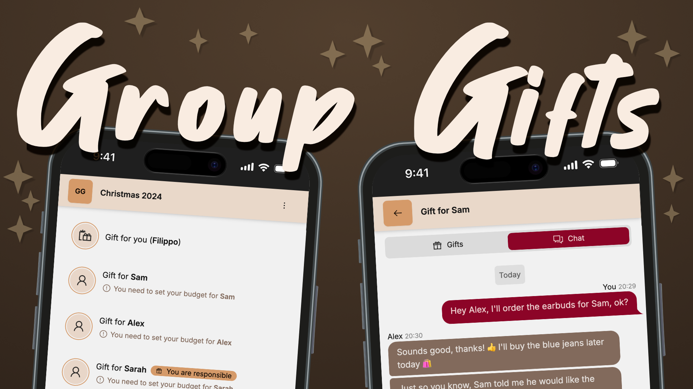
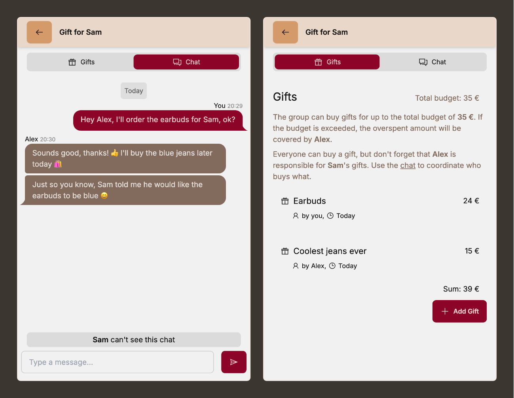
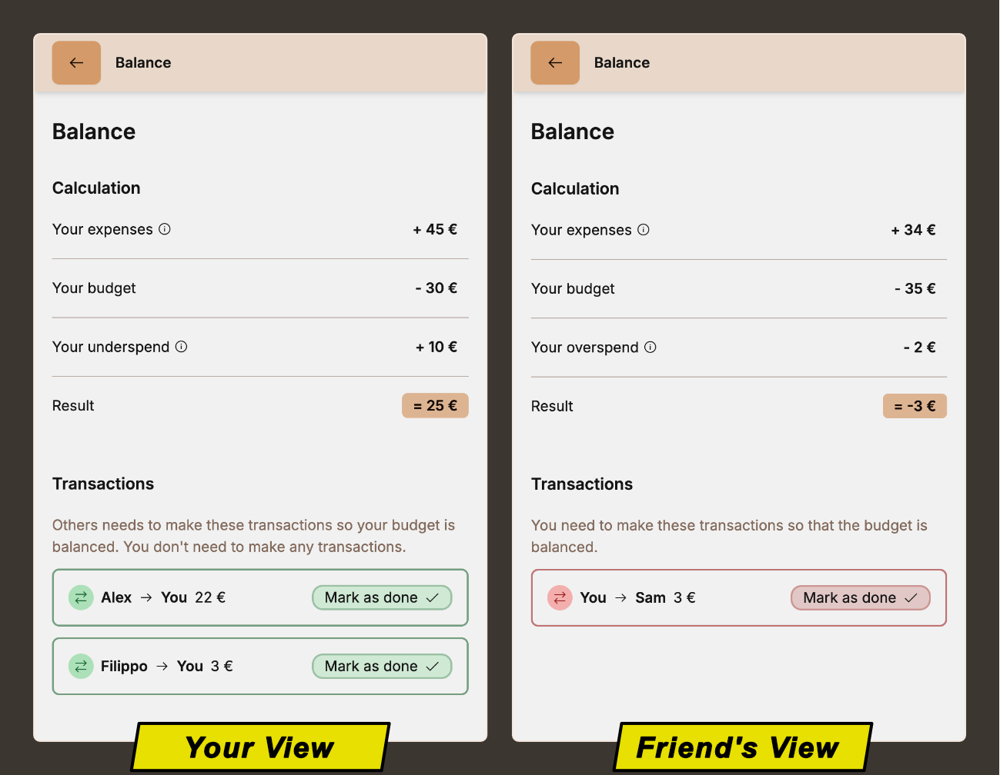

Group gifts makes Christmas in a large friend group stress-free! 

It works like this:

1. Create a group and invite all your friends or family members
2. Write your wishlist and set your budget for everyone
3. Chat about other people's wishes
4. Everyone only buys gifts for the person they were assigned to

## 👉🏻 Try it out now at [gifts.filippo-orru.com](https://gifts.filippo-orru.com)

*Write your wishlist. Your friends can see it and get you exactly what you wished for.*

*Use the **chat** to coordinate and then enter the gifts and their price.*

*After Christmas is over, check the **balance** page to see who owes and who gets money.*